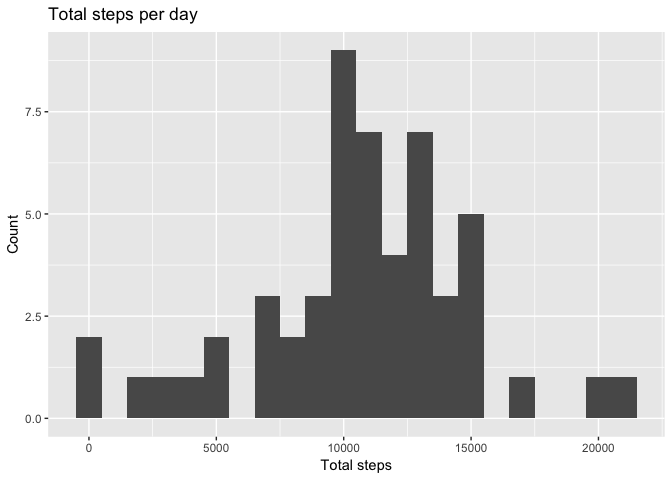
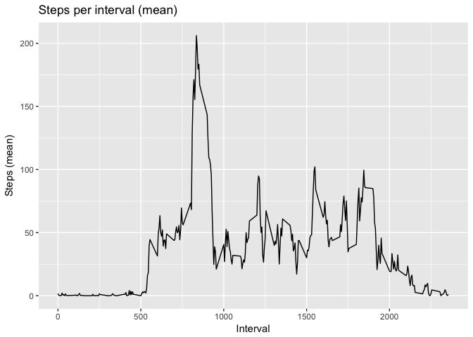
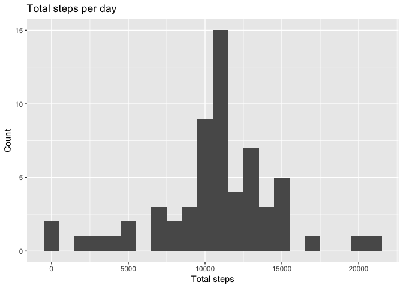
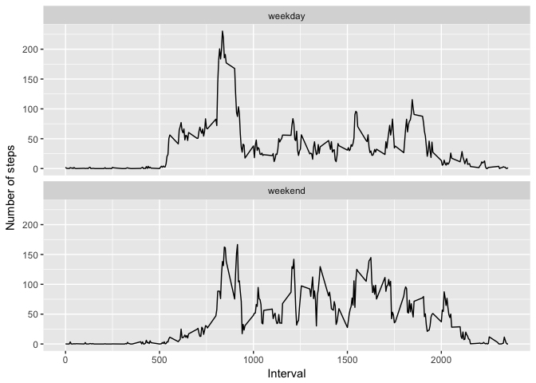

# Reproducible Research: Peer Assessment 1

## Introduction

It is now possible to collect a large amount of data about personal movement using activity monitoring devices such as a Fitbit, Nike Fuelband, or Jawbone Up. These type of devices are part of the “quantified self” movement – a group of enthusiasts who take measurements about themselves regularly to improve their health, to find patterns in their behavior, or because they are tech geeks. But these data remain under-utilized both because the raw data are hard to obtain and there is a lack of statistical methods and software for processing and interpreting the data.

This assignment makes use of data from a personal activity monitoring device. This device collects data at 5 minute intervals through out the day. The data consists of two months of data from an anonymous individual collected during the months of October and November, 2012 and include the number of steps taken in 5 minute intervals each day.

Dataset: Activity monitoring data [52K]
The variables included in this dataset are:

* steps: Number of steps taking in a 5-minute interval (missing values are coded as 𝙽𝙰)
* date: The date on which the measurement was taken in YYYY-MM-DD format
* interval: Identifier for the 5-minute interval in which measurement was taken

## Loading and preprocessing the data
Questions/tasks:

1. Load the data
2. Process/transform the data (if necessary) into a format suitable for your analysis

First load the library's we are going to need.

```r
library(lubridate)
library(dplyr)
library(ggplot2)
```

To get the data we have to unzip it. This gives us the "activity.csv" file, with all the data.

```r
unzip("activity.zip")
list.files(pattern="*.csv")
```

```
## [1] "activity.csv"
```

So let's read the data. And convert the date-string to a date.

```r
act_data <- read.csv("activity.csv")
act_data$date <- ymd(act_data$date)
str(act_data)
```

```
## 'data.frame':	17568 obs. of  3 variables:
##  $ steps   : int  NA NA NA NA NA NA NA NA NA NA ...
##  $ date    : Date, format: "2012-10-01" "2012-10-01" ...
##  $ interval: int  0 5 10 15 20 25 30 35 40 45 ...
```

## What is mean total number of steps taken per day?
Questions/tasks:

1. Calculate the total number of steps taken per day
2. If you do not understand the difference between a histogram and a barplot, research the difference between them. Make a histogram of the total number of steps taken each day
3. Calculate and report the mean and median of the total number of steps taken per day

First calculate the total steps taken per day.

```r
stepsperdate <- act_data %>% 
    group_by(date) %>% 
    summarise(totalSteps = sum(steps))
```

And then take a look at the histogram, and the median and mean.

```r
g <- ggplot(data=stepsperdate, aes(stepsperdate$totalSteps)) +
    geom_histogram(binwidth=1000) +
    labs(title ="Total steps per day", x = "Total steps", y = "Count")
print(g)
```

<!-- -->

```r
summary(stepsperdate$totalSteps)
```

```
##    Min. 1st Qu.  Median    Mean 3rd Qu.    Max.    NA's 
##      41    8841   10765   10766   13294   21194       8
```

## What is the average daily activity pattern?
Questions/tasks:

1. Make a time series plot of the 5-minute interval (x-axis) and the average number of steps taken, averaged across all days (y-axis)
2. Which 5-minute interval, on average across all the days in the dataset, contains the maximum number of steps?

So, we have to group the data by interval and calculate the mean for each interval.

```r
stepsperinterval <- act_data %>% 
    group_by(interval) %>% 
    summarise(meanSteps = mean(steps, na.rm=TRUE))
```
Let's take a look at those intervals.

```r
g <- ggplot(data=stepsperinterval, aes(x = stepsperinterval$interval, y = stepsperinterval$meanSteps)) + 
    geom_line() + 
    labs(title ="Steps per interval (mean)", x = "Interval", y = "Steps (mean)")
print(g)
```

<!-- -->

And the interval with the maximum steps is:

```r
maxIndex <- which(stepsperinterval$meanSteps == max(stepsperinterval$meanSteps))
print(stepsperinterval$interval[[maxIndex]])
```

```
## [1] 835
```
So, that is 8:35 in the morning.

## Imputing missing values
Questions/tasks:

Note that there are a number of days/intervals where there are missing values (coded as 𝙽𝙰). The presence of missing days may introduce bias into some calculations or summaries of the data.

1. Calculate and report the total number of missing values in the dataset (i.e. the total number of rows with NAs)
2. Devise a strategy for filling in all of the missing values in the dataset. The strategy does not need to be sophisticated. For example, you could use the mean/median for that day, or the mean for that 5-minute interval, etc.
3. Create a new dataset that is equal to the original dataset but with the missing data filled in.
4. Make a histogram of the total number of steps taken each day and Calculate and report the mean and median total number of steps taken per day. Do these values differ from the estimates from the first part of the assignment? What is the impact of imputing missing data on the estimates of the total daily number of steps?

The number of missing values is:

```r
print(sum(is.na(act_data$steps)))
```

```
## [1] 2304
```

For filling the missing values, I have chosen to replace an NA with the mean of that 5-minute interval.

```r
act_data_complete <- act_data

len <- length(act_data_complete$steps)
for (i in 1:len) {
    if (is.na(act_data_complete$steps[i])) {
        indexInterval <- which(stepsperinterval$interval == act_data_complete$interval[i])
        act_data_complete$steps[i] <- stepsperinterval$meanSteps[indexInterval]
    }
}
```

Now, look at the histogram, mean and median for the total steps taken per day.

```r
stepsperdate <- act_data_complete %>% 
    group_by(date) %>% 
    summarise(totalSteps = sum(steps))

g <- ggplot(data=stepsperdate, aes(stepsperdate$totalSteps)) +
    geom_histogram(binwidth=1000) +
    labs(title ="Total steps per day", x = "Total steps", y = "Count")
print(g)
```

<!-- -->

```r
summary(stepsperdate$totalSteps)
```

```
##    Min. 1st Qu.  Median    Mean 3rd Qu.    Max. 
##      41    9819   10766   10766   12811   21194
```

As we can see, that mainly the 1st and 3rd quantile have both shifted to the middle. The minimum, maximum and mean haven't changed. The median has a minimum change (just a change of 1).

But if we look at the histograms, we see that only bin 11.000 to 12.000 steps has changed. In the first histogram it was 7, in the second it is 15. We saw that we have 2304 missing values. We also saw that we have 8 missing days (the NA's in the first summary). This means that all the missing values were on these 8 missing days (8 * 24 * 12 = 2304). By filling them with the average, the mean-bin has grown with 8.


## Are there differences in activity patterns between weekdays and weekends?

For this part the weekdays()-function may be of some help here. Use the dataset with the filled-in missing values for this part.

1. Create a new factor variable in the dataset with two levels – “weekday” and “weekend” indicating whether a given date is a weekday or weekend day.
2. Make a panel plot containing a time series plot of the 5-minute interval (x-axis) and the average number of steps taken, averaged across all weekday days or weekend days (y-axis).

Add column with a factor indicating if the day is a weekday or weekend (note: my laptop is Dutch, so the weekdays are mentioned in Dutch).

```r
act_data_complete <- mutate(act_data_complete, dayOfTheWeek = weekdays(date))
act_data_complete <- mutate(act_data_complete, weekday = "weekday")
act_data_complete$weekday[which(act_data_complete$dayOfTheWeek == "zaterdag" | act_data_complete$dayOfTheWeek == "zondag")] <- "weekend"
act_data_complete$weekday <- factor(act_data_complete$weekday)
```

Now create the panel plot for weekday and weekend.

```r
act_data_weekend <- act_data_complete %>% 
    group_by(weekday, interval) %>% 
    summarise(meanSteps = mean(steps))

g <- ggplot(act_data_weekend, aes(x = interval, y = meanSteps, group=weekday)) + 
    facet_wrap(~ weekday, nrow = 2) +
    geom_line() + 
    labs(x = "Interval", y = "Number of steps")
print(g)
```

<!-- -->

If we compare both plots, we see that in the weekend the person starts walking a little bit later, and that during the day more steps are taking than on weekdays.
